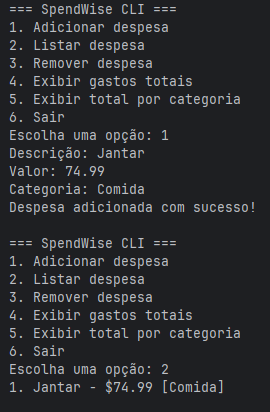

# SpendWise CLI

SpendWise é um aplicativo de command-line desenvolvido para ajudar os outros organizar e manejar suas despesas pessoais. 

## Problema

Muitas pessoas hoje em dia podem ter dificuldades gerenciando suas finâncias porque elas dependem de métodos velhos ou ineficientes. Isso leva à gastos excessivos e fica difícil manter o seu orçamento.

## Solução Proposta

SpendWise CLI permite usuários a registar, listar, remover, e analisar despesas diretamente através do terminal, providenciando uma maneira simples de monitorar gastos pessoais.

## Público-alvo

- Alunos
- Adultos jovens
- Pessoas que querem uma ferramenta de orçamento simples
- Usuários procurando um software lightweight de organização financeira

## Funcionalidades Principais

- Adicionar despesas
- Listar despesas registradas
- Remover despesas
- Calcular gastos totais
- Exibir gastos por categoria
- Armazenamento de dados persistentes usando JSON

## Tecnologias Utilizadas

- Python
- Pytest
- Ruff
- GitHub Actions

## Estrutura do Projeto

```txt
SpendWise/
├── src/
├── tests/
├── .github/workflows/
├── README.md
├── requirements.txt
└── VERSION
```
## Nova funcionalidade - Etapa 2

O SpendWise agora possui integração com a API pública de câmbio Frankfurter, permitindo a conversão total de despesas registradas para mais de 30 moedas internacionais, à escolha do usuário, em tempo real. Pode encontrar a nova opção para converter o total de despesas para outra moeda já no menu.

## Instalação

Clone o repositório:

```bash
git clone https://github.com/GabrielSanchez12/SpendWise.git
```

Acesse a pasta do projeto:

```bash
cd SpendWise
```

Crie o ambiente virtual:

## Para Windows

```bash
python -m venv .venv
.venv\Scripts\activate
```

## Para Linux/Mac

```bash
python3 -m venv .venv
source .venv/bin/activate
```

Instalar dependências:

```bash
pip install -r requirements.txt
```

## Executando o Aplicativo:

Execute o aplicativo com: 

```bash
python -m src.spendwise.app
```

## Executando Testes

```bash
pytest
```

## Executando Lint

```bash
ruff check .
```

## Versão Atual

```txt
1.0.0
```

## Autor/Dev

Gabriel Arakaki-Sanchez

## Repositório Público

https://github.com/GabrielSanchez12/SpendWise


